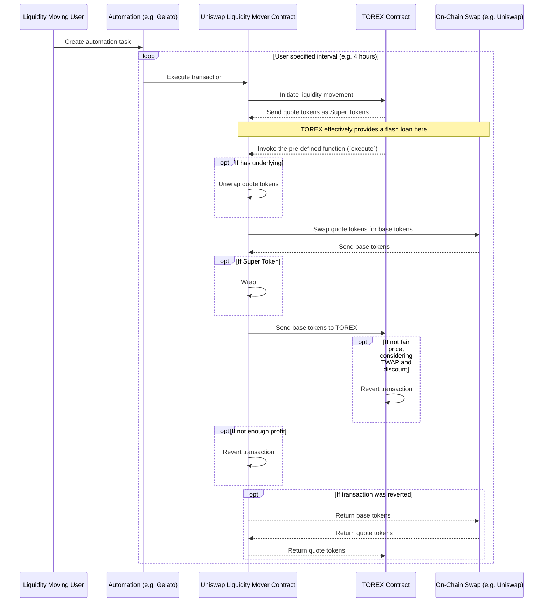
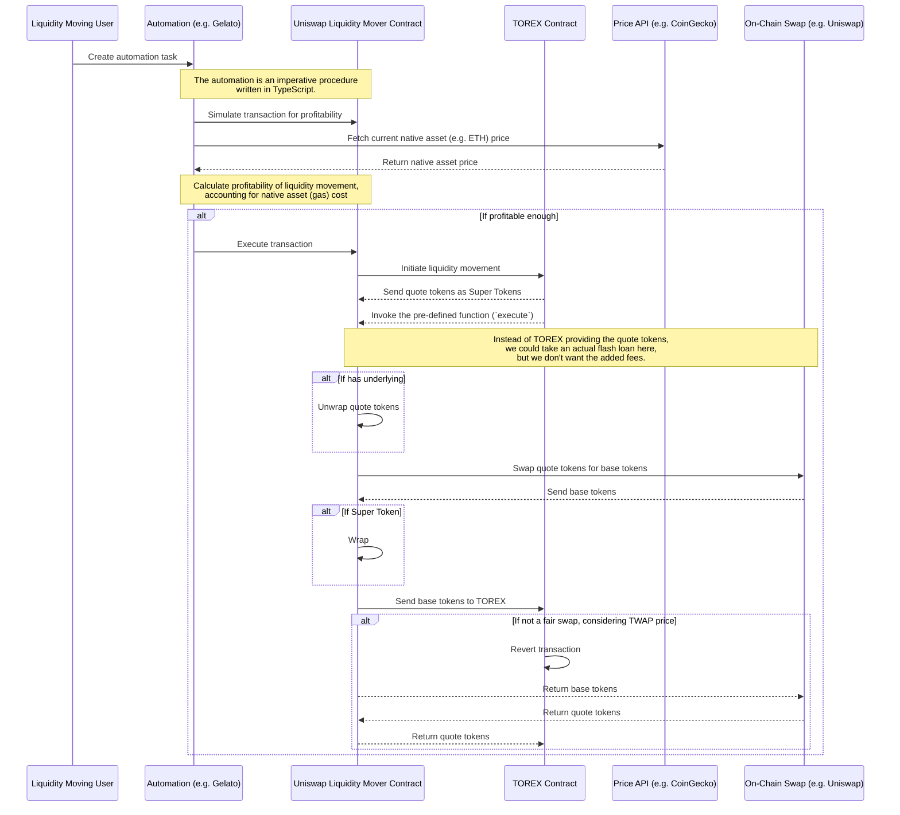

# Basic Liquidity Movement Solution for TOREX (TDD)

## Problem statement

We are in the process of developing an investment application codenamed "AverageX" that utilizes dollar-cost averaging
(DCA) using Superfluid money streams.

However, we need a mechanism to exchange quote tokens (such as USDCx) into the required base tokens (such as ETHx). We
have devised a concept called "TOREX", which accumulates quote tokens through money streams and incentivizes swapping
them to base tokens securely and fairly.

A swap from quote tokens to base tokens, a "liquidity movement event", involves a single atomic transaction by an
outside actor in a decentralized incentivized environment. In this transaction, we receive the quote token from TOREX,
swap it to the base tokens using a liquidity source (Uniswap pool for example), transfer enough base tokens to meet the
TWAP-based benchmark price, and keep the surplus liquidity as a reward for the "liquidity mover".

Links: AverageX TDD: https://www.notion.so/superfluidhq/AverageX-TDD-0cf007eacfab4fa1bb34873787a66538?pvs=4 AverageX
PRD: https://www.notion.so/superfluidhq/AverageX-PRD-04b945ba705f427d80e3d0c905550922#fc136b8245a24c31a53756f6b77b614c
TOREX write-up: https://www.notion.so/superfluidhq/TOREX-17979bb24d0d4901a355293083788a44

### Scope

To summarize the requirements, we need:

- An easily deployable solution that can be used as a liquidity mover for various TOREX pools.
- Minimize development and maintenance work by using existing products for off-chain scheduling and transaction
  execution.
- Have the solution be secure and reliable.
- Make the solution profitable to run.

In the future, specialized solutions can be created to optimize profitability further by finding the best swap routes,
reducing gas costs by doing more work off-chain, and focusing on a specific TOREX without needing to handle generic edge
cases.

## Rationale

The liquidity movement solution is crucial to the functioning of the DCA dApp. The decentralization and easy-to-use
aspect is essential in our positioning of the DCA product.

## Proposed solution

The TOREX will provide an `ILiquidityMover` interface to which it will do a callback on liquidity movement execution and
transfer the quote tokens to fulfill the swap. If the swap doesn't satisfy the benchmark price, in other words, the
TOREX doesn't end up with as many tokens as it expects, the whole transaction will revert.

The plan is to leverage the Web3 Functions offering from Gelato, which takes care of off-chain scheduling and efficient
transaction execution. It provides a streamlined approach for automating a fully on-chain solution and a solution
requiring off-chain components for querying and calculations.

The proposition is to start with the fully on-chain solution as it is more contained in its implementation choices. It
keeps the solution transparent on-chain and easily automatable with a simple polling-based mechanism.

The source of liquidity for the swap can be the Uniswap V3 pool, which is the basis of the TOREX TWAP price.

The primary part of the implementation is the `LiquidityMoverContract` from the conceptual overview diagram.

The conceptual overview diagram (without off-chain component):

The conceptual overview diagram (with off-chain component):

### Testability

The smart contract implementation should be tested with unit tests, which most likely need to incorporate blockchain
forking to mimic a liquidity source realistically (a Uniswap pool).

### Observability (Metrics, logs & monitoring)

The execution statuses, the profitability of the executions, and the balance of gas tokens need to be monitored.

From the perspective of the liquidity mover, they can use what Gelato offers. Read more:
https://docs.gelato.network/developer-services/web3-functions/analytics-and-monitoring

From the perspective of the analytics about the Superfluid ecosystem, consideration should be given to adding log events
to the liquidity mover smart contract for easier querying of the liquidity movements and their profitability.

### Security

TODO

### Risks

Gelato might not be deployed to all the networks we wish to deploy the DCA app on. The liquidity movement might not be
profitable when the TWAP price consistently increases, and the gas is expensive. Uniswap V3 pool might be a poor choice
for liquidity. (This would be a broader problem as the benchmark TWAP price also comes from there.)

### Alternative solutions considered

If you have discussed any alternative approaches, list them here together with their pros and cons.
